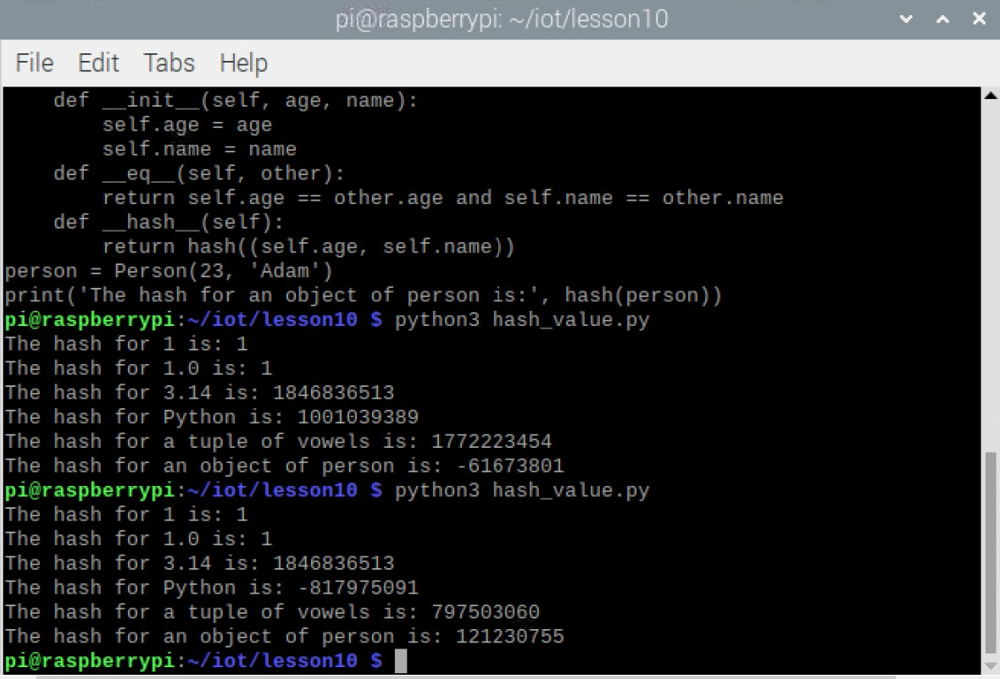
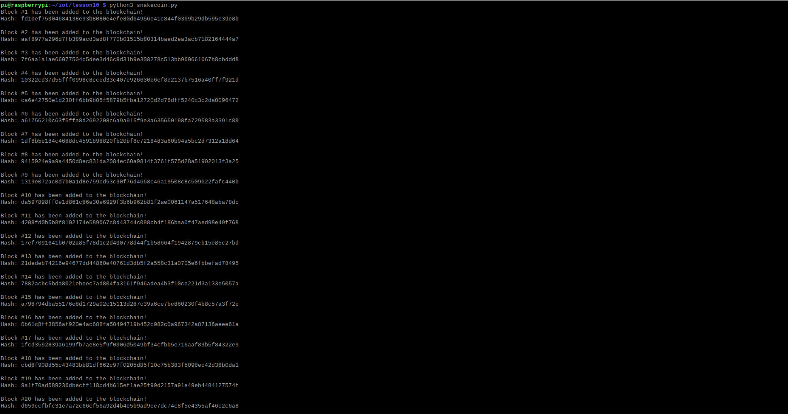
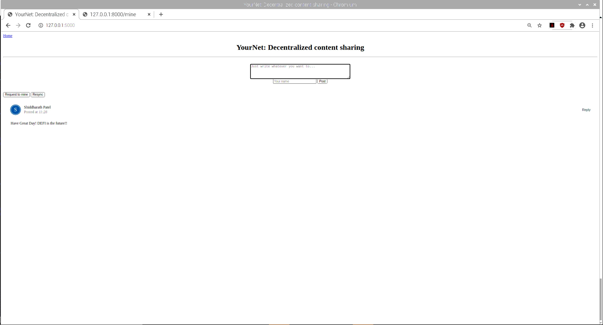
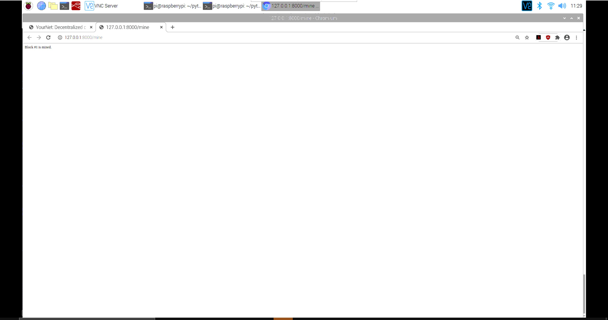
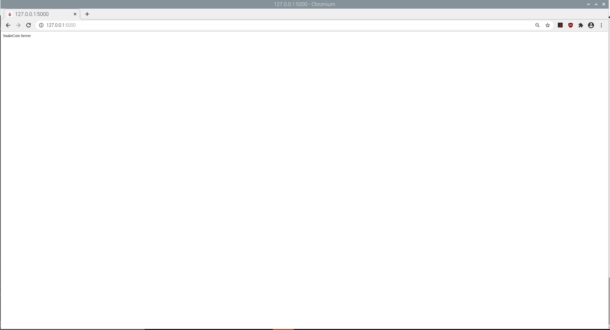
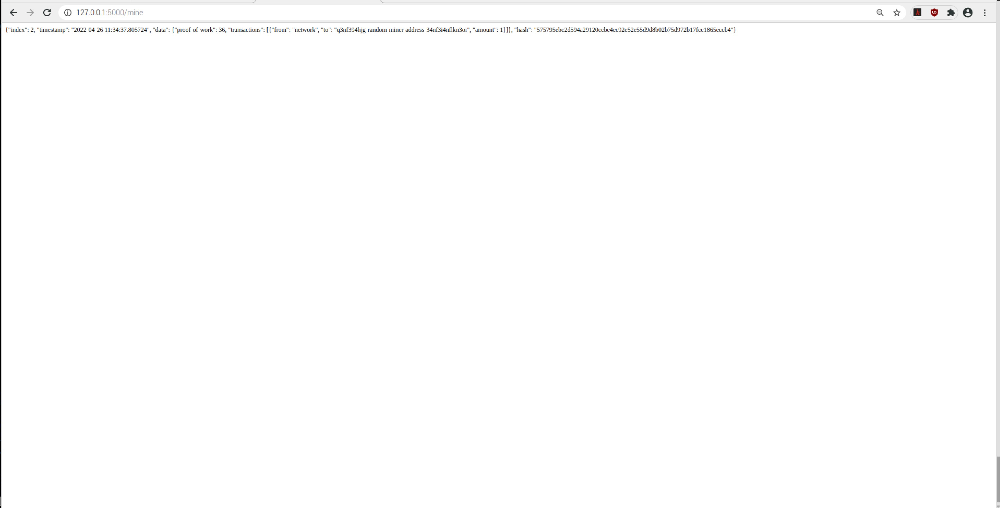
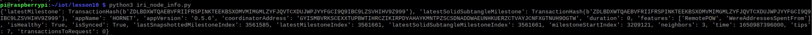

# Labs 10 - Blockchain

I pledge my honor that I have abided by the Stevens Honor System.

## hash_value.py

## snakecoin.py

## node_server.py & run_app.py

## snakecoin-server-full-code.py

## iri_node_info.py

