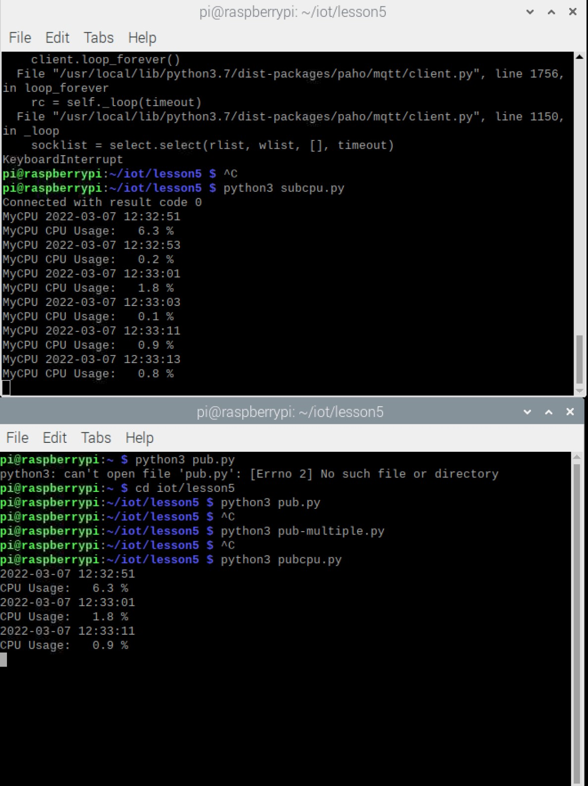

# Lab 5 - Paho-MQTT

I pledge my honor that I have abided by the Stevens Honor System.

### Test - Topic

### PAHO Install

### python sub, pub, 

### sub-multiple, pub-multiple

### python subcpu and pubcpu

### subraspi and pubraspi

